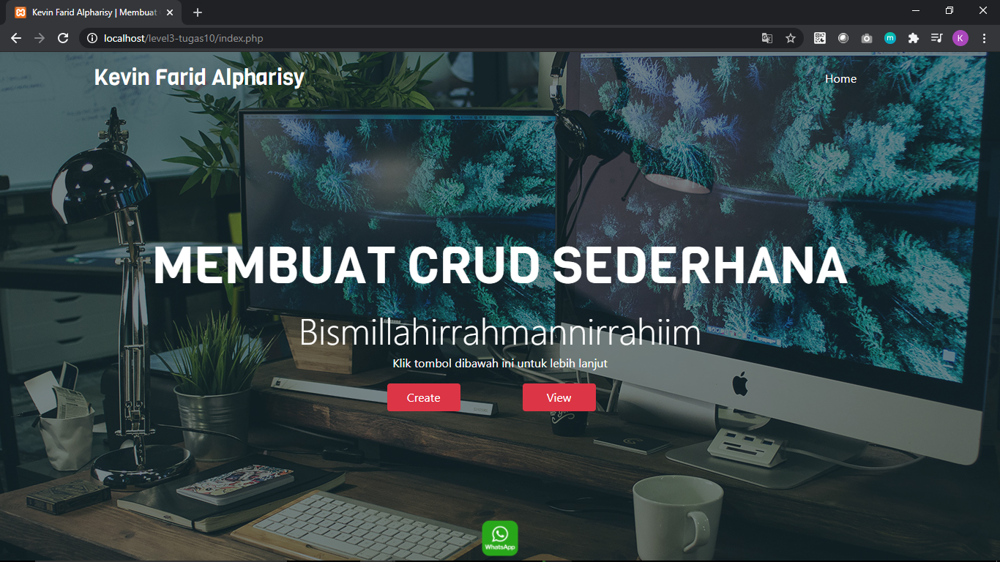

# Level 3 - Tugas 10 | an : Kevin Farid Alpharisy email : kevinfaridap@gmail.com

Penjelasan Singkat :
Untuk tugas 10 - level 3 ini saya membuat dengan bootstrap 4 untuk tampilan depan sederhana dan database nya dengan mySQL,xampp. Terdapat 4 bagian pada laman CRUD sederhana ini. Laman index.php, create.php, update.php dan view.php. Untuk lebih jelas seperti screenshoot dibawah ini.

Laman AWAL/index

Laman create

Laman Update

Laman View

